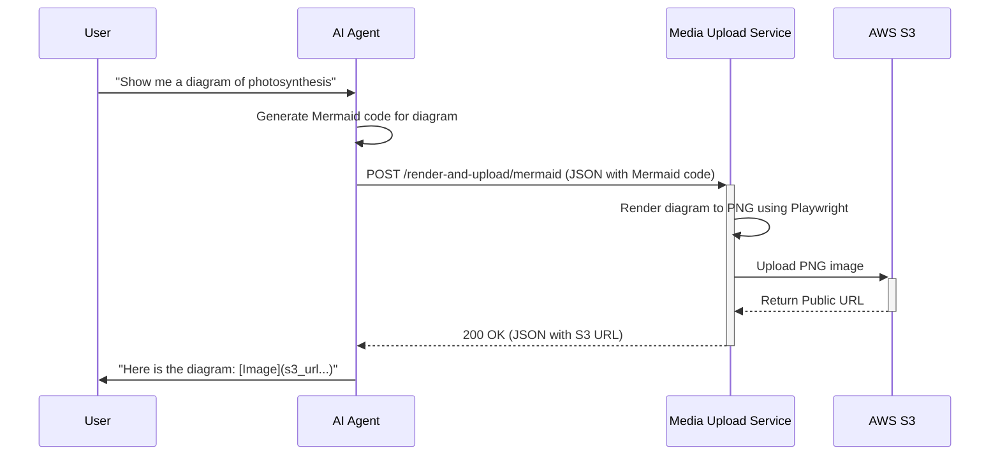

# AI Agent Integration Guide: Media Upload Service

## 1. Introduction

This guide provides a comprehensive walkthrough for integrating AI agents with the Centralized S3 Media Upload Service. By following this guide, you can empower your agent to generate rich media content (such as diagrams and syntax-highlighted code) and include it in its responses.

The core principle is simple: your agent generates text-based content, sends it to this service, and gets back a public URL to the final, rendered media asset.

---

## 2. Integration Workflow

The interaction between the AI Agent and the Media Upload Service follows a straightforward, 4-step process:



1.  **Generate**: The AI Agent generates the raw content (e.g., Mermaid syntax, Python code).
2.  **Request**: The Agent makes an HTTP POST request to the appropriate endpoint on the Media Upload Service, with the content in the JSON body.
3.  **Process & Upload**: The service receives the request, renders the content into the desired image format, and uploads it to the configured S3 bucket.
4.  **Respond & Utilize**: The service returns the public S3 URL of the new asset. The Agent can then embed this URL in its final response to the user (e.g., using Markdown for an image).

---

## 3. API Reference for Agents

This section details the specific endpoints an agent will most commonly use.

**Base URL**: `http://<service_host>:<port>` (e.g., `http://localhost:8001`)

### Endpoint: `/render-and-upload/code`

*   **Use Case**: Convert a block of source code into a syntax-highlighted PNG image.
*   **Method**: `POST`
*   **Request Body** (`application/json`):
    ```json
    {
      "code": "def hello_world():\n    print('Hello, World!')",
      "language": "python",
      "style": "solarized-dark",
      "file_name": "my_first_code.png",
      "user_id": "agent-session-123"
    }
    ```
    *   `code` (str, required): Raw source code, including newlines (`\n`).
    *   `language` (str, required): The language for syntax highlighting (e.g., `python`, `javascript`, `go`).
    *   `style` (str, optional): A `pygments` style name. Defaults to `default`.
    *   `file_name` (str, required): A base name for the file.
    *   `user_id` (str, required): A unique identifier for the agent or user session.
*   **Success Response** (200 OK):
    ```json
    {
      "s3_url": "https://<bucket>.s3.<region>.amazonaws.com/code/agent-session-123/timestamp_id_my_first_code.png",
      "file_path": "code/agent-session-123/timestamp_id_my_first_code.png",
      "message": "Source code rendered and uploaded successfully"
    }
    ```
*   **Error Response** (500 Internal Server Error): Indicates a failure during rendering or upload. The `detail` key will contain the error message.

---

### Endpoint: `/render-and-upload/mermaid`

*   **Use Case**: Convert Mermaid diagram syntax into a PNG image.
*   **Method**: `POST`
*   **Request Body** (`application/json`):
    ```json
    {
      "mermaid_code": "graph TD\\nA-->B",
      "file_name": "my_flowchart.png",
      "user_id": "agent-session-123"
    }
    ```
    *   `mermaid_code` (str, required): The raw Mermaid syntax.
    *   `file_name` (str, required): A base name for the file.
    *   `user_id` (str, required): A unique identifier for the agent or user session.
*   **Success Response** (200 OK):
    ```json
    {
      "s3_url": "https://<bucket>.s3.<region>.amazonaws.com/diagrams/agent-session-123/timestamp_id_my_flowchart.png",
      "file_path": "diagrams/agent-session-123/timestamp_id_my_flowchart.png",
      "message": "Mermaid diagram rendered and uploaded successfully"
    }
    ```
*   **Error Response** (500 Internal Server Error): Indicates a failure during rendering or upload. The `detail` key will contain the error message.

---

## 4. Python Integration Example

Here is a practical example of how an agent could call this service using Python's `requests` library.

```python
import requests
import json

# Configuration for the Media Upload Service
SERVICE_URL = "http://localhost:8001"
USER_ID = "agent-alpha-007"

def render_python_code_to_image(code_snippet: str, filename: str) -> str:
    """
    Calls the media service to render Python code and returns the S3 URL.
    
    Args:
        code_snippet: The Python code to render.
        filename: The desired output filename.
        
    Returns:
        The public S3 URL of the rendered image.
        
    Raises:
        Exception: If the API call fails.
    """
    endpoint = f"{SERVICE_URL}/render-and-upload/code"
    
    payload = {
        "code": code_snippet,
        "language": "python",
        "file_name": filename,
        "user_id": USER_ID,
        "style": "monokai" # A popular dark theme
    }
    
    try:
        response = requests.post(endpoint, json=payload, timeout=60)
        
        # Check for a successful response
        if response.status_code == 200:
            response_data = response.json()
            s3_url = response_data.get("s3_url")
            print(f"Successfully generated image: {s3_url}")
            return s3_url
        else:
            # Handle errors
            error_details = response.text
            raise Exception(f"API Error: Status {response.status_code} - {error_details}")
            
    except requests.exceptions.RequestException as e:
        raise Exception(f"Failed to connect to the Media Upload Service: {e}")

# --- Example Usage ---
if __name__ == "__main__":
    
    # 1. Agent generates some code
    my_code = "class Agent:\n    def __init__(self, name):\n        self.name = name\n\nagent = Agent('Alpha')"
    
    try:
        # 2. Agent calls the service to get the image URL
        image_url = render_python_code_to_image(my_code, "agent_class_example.png")
        
        # 3. Agent includes the URL in its final response
        agent_final_response = f"Here is a visual representation of the `Agent` class:\n\n"
        
        print("\n--- Agent's Final Response ---")
        print(agent_final_response)
        
    except Exception as e:
        print(f"Error during media generation: {e}")

```

### Error Handling

An agent integrating with this service should be prepared to handle two primary types of errors:
1.  **Connection Errors**: The service might be down or inaccessible. The agent should catch these `requests.exceptions.RequestException` errors and fall back gracefully (e.g., providing the content as a raw code block instead of an image).
2.  **API Errors**: The service might return a non-200 status code (e.g., 4xx or 5xx). The agent should inspect the response body for a `detail` key to understand the cause of the failure and report a meaningful error. 